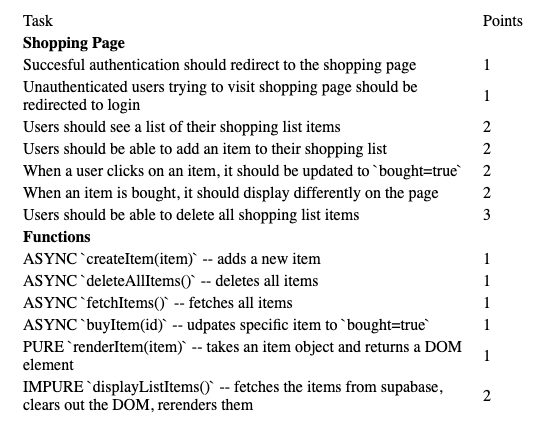

 

# Vertical Slices

-   Users should be able to add items to their shopping list (CREATE)
-   Users should see a list of shopping items (READ)
-   Users should be able to mark items as bought (UPDATE)
-   Users should be able to delete all the items from their list (DELETE)

1. Set up database

    - make a table
    - foreign key relationship to users table (uuid)
    - rls for user_id = uid()

2. Create (form)

    - create function in fetch-utils
    - add submit event listener
    - grab data using new FormData and send to supabase

3. List all items (ul)

    - fetch function in fetch-utils
    - render function in render-utils
    - write display function in app.js
    - call display function on page load

4. Update Item

    - cross out item
    - update function in fetch-utils
    - event handler in list el (when they are rendered, we make them clickable)
    - re-display the list (call display function again)

5. Delete (button)
    - delete function in fetch-utils
    - add-event listener to call the delete function
